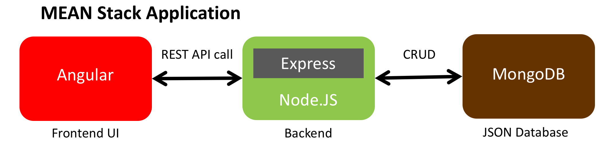
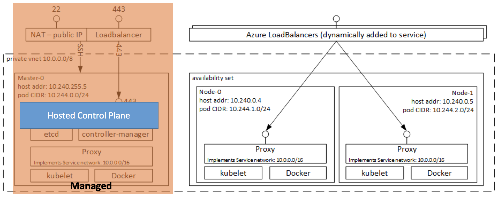

# azure-containers-mean-stack-demo
MEAN Stack App Conatiner Demos using Azure Container related services and PaaS

## Topics
- Azure Web App for Containers + Cosmos DB
- ACS Engine + Kubernetes
- Azure Kubernetes Service (AKS)
- Azure Kubernetes Service (AKS) + Cosmos DB + OMS
- Automation, Scaling, Networking, Monitoring
- DevOps

## Azure Web App for Containers + Cosmos DB

TBU

## ACS Engine + Kubernetes
K8S cluster architecture deployed with acs-engine

TBU

## Azure Kubernetes Service (AKS)
K8S cluster architecture deployed with AKS

TBU

## Azure Kubernetes Service (AKS) + Cosmos DB + OMS

TBU

## Dev Ops
TBU