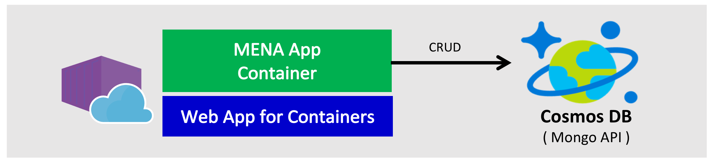

# Tutorial: Running MEAN Stack App Container in Azure using Web App for Containers and Cosmos DB





## Setup Azure Cosmos DB

### Create an Azure Cosmos DB account and Database

```
# Create a MongoDB API Cosmos DB account
az cosmosdb create \
    --name $ACCOUNT_NAME \
    --kind MongoDB \
    --resource-group $RESOURCE_GROUP \

# Create a database
az cosmosdb database create \
    --name $ACCOUNT_NAME \
    --db-name $DATABASE_NAME \
    --resource-group $RESOURCE_GROUP
```

Alternatively, you can create by running the following script:
```
scripts/cosmosdb-mongo-create.sh
```

### Get the Cosmos DB (Mongo API) connection string for the application

Retrieve the primary master key by running the following command:
```
az cosmosdb list-keys \
    --name $ACCOUNT_NAME \
    --resource-group $RESOURCE_GROUP \
    --query "primaryMasterKey"
```

Then, get the connection string by replacing cosmosdb-name, primary-master-key, and database-name with your values in the following string:
```
mongodb://<cosmosdb-name>:<primary_master_key>@<cosmosdb-name>.documents.azure.com:10255/<database-name>?ssl=true&sslverifycertificate=false
```

Alternatively, you can get the connectiong string result by running the following script:
```
scripts/cosmosdb-mongo-create.sh
```

## Build, Run a Docker image and push it to a Container Registery

Build the image (suppose the container image tag is 0.0.1)
```
git clone https://github.com/yokawasa/azure-containers-mean-stack-demo.git

cd azure-containers-mean-stack-demo/dockerfiles 
docker build -t  .
docker build -t mean-demo:0.0.1 .

```

Test the images by running the Docker image locally
```
# Run the container with the connection string that you obtain in previous steps
docker run --rm -it -p 8080:80 -p 3000:3000 -p 2222:2222 -e MONGODB_URI="$MONGODB_CONNECTION_STRING" -e CONTAINER_ROLE="ALL" mean-demo:0.0.1

# Access the app with 8080 port
curl localhost:8080
```

Finally, tag and push the image to the registry (ex. yoichika.azurecr.io )
```
docker login $REGISTRY_URL -u $REGISTRY_NAME -p $REGISTRY_PASSWORD

docker tag mean-demo:0.0.1 $REGISTRY_URL/mean-demo:0.0.1

docker push $REGISTRY_URL/mean-demo:0.0.1

docker logout
```

## Setep Web App and Run the app

### Create App service plan (if not yet created)

You need an App Service plan in the Standard pricing tier (--sku S1) and in a Linux container (--is-linux) in order to create an account for Web App for Container.
```
az appservice plan create \
  --name $APP_PLAN \
  --resource-group $RESOURCE_GROUP \
  --sku S1 --is-linux
```
Alternatively, you can create the plan by running the following script:
```
scripts/app-service-plan-create.sh
```

### Create Web APP
```
# Create Web App for Container
az webapp create \
  -n $APP_NAME \
  -g $RESOURCE_GROUP \
  -p $APP_PLAN \
  -i $CONTAINER_IMAGE
```

Alternatively, you can create web app by running the following script:
```
scripts/webapp-create.sh
```

### Update Web App Settings and Run the app
```
az webapp config appsettings set \
  -n $APP_NAME \
  -g $RESOURCE_GROUP \
  --settings MONGODB_URI=$COSMOSDB_CONN_STRING WEBSITES_ENABLE_APP_SERVICE_STORAGE=true WEBSITES_PORT=80
```
Alternatively, you can create web app by running the following script:
```
scripts/webapp-update-settings.sh
```

Finally, access and test the web app:
```
curl https://<APP_NAME>.azurewebsites.net
```
